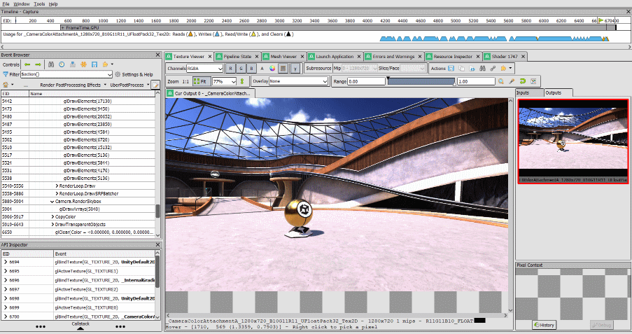
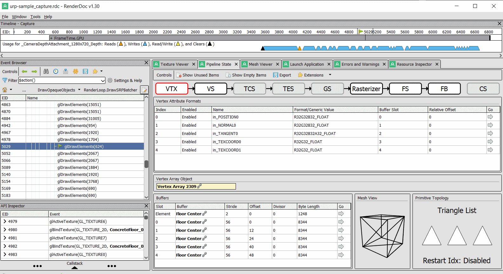

# RenderDoc – Frame Analysis (1h)

## Introduction

Dans ce TP, nous allons ouvrir et analyser une capture de jeu à l'aide de RenderDoc.  
La capture a été réalisée dans le template [URP 3D Sample](https://unity.com/demos/urp-3d-sample) du moteur Unity.

Ce template utilise l’Universal Render Pipeline, qui contient un grand nombre de features de rendu. L’objectif n’est pas d’analyser chaque élément en détail, mais d’apprendre à utiliser RenderDoc pour naviguer dans la composition d’une frame et inspecter les différentes ressources : textures, buffers, shaders, etc.

La capture a été réalisée avec l’API *OpenGL* afin de rester cohérent avec le cours de programmation graphique.

???+ abstract "Rendu de TP"
    Un court compte-rendu de TP est à rendre à la fin de celui-ci.  
    Il faudra répondre aux questions encadrées.  
    Aucune mise en page spécifique n’est requise, de simples phrases suffisent.

!!! info
    Si vous êtes bloqué, n’hésitez pas à solliciter votre encadrant.

## Premiers pas

[Unity](https://docs.unity3d.com/6000.2/Documentation/Manual/RenderDocIntegration.html) et [Unreal](https://dev.epicgames.com/documentation/en-us/unreal-engine/using-renderdoc-with-unreal-engine) disposent d’outils permettant de lancer une capture RenderDoc depuis l’éditeur ou via script.  
Pour simplifier le processus, nous allons directement étudier une capture effectuée depuis l’éditeur Unity.

[Télécharger la capture (157 Mo)](https://noe.masse.pro/content/urp-sample_capture.rdc){ .md-button }

Vous pouvez ouvrir la capture via le menu `File > Open Capture`.

Voici le logiciel une fois la capture ouverte :

* **Event Browser** Permet de naviguer à travers les différentes phases et appels d’API de la frame capturée. Chaque événement possède un ID et certains sont regroupés par sections.
* **Texture Viewer** Permet de visualiser les textures utilisées lors d’un événement.
* **Pipeline State** Permet de visualiser les états du pipeline lors d’un drawcall : ressources attachées, shader utilisé, etc.
* **Mesh Viewer** Permet d’inspecter les données du mesh utilisé lors d’un drawcall.
* **Resource Inspector** Regroupe toutes les ressources créées durant la frame.

Pour faciliter la navigation, vérifiez que le filtre de l’**Event Browser** soit `$action()`.

Avec le **Texture Viewer** ouvert, ouvrez la section `(EID 511-6810) FrameTime.GPU > UIR.DrawChain` et parcourez les différents éléments.

!!! question "Questions"
    À quoi correspondent, selon vous, les sections `GUITexture.Draw` ?  
    Quelle section est la plus susceptible de nous intéresser ?

Les captures peuvent contenir une grande quantité d’événements et de données non pertinentes. Il est donc essentiel de savoir naviguer efficacement.

## Composition de la Frame

Positionnez-vous sur la section `(EID 1427-6715) ScriptableRenderer.Execute: PC_High_Renderer`.  
En gardant le **Texture Viewer** ouvert, parcourez les différentes sections.

!!! question
    Décrivez brièvement les différentes passes de rendu du renderer.  
    Pour chaque passe, donnez le nom des Outputs et votre intuition quant à leur rôle.  
    Certains outputs peuvent être difficiles à interpréter, c’est normal.  
    Ignorez l’événement *LightCookies*.

## Draw Object Passes

On observe deux passes principales pour dessiner les objets : une pour les objets opaques et une pour les objets transparents.

Une particularité du renderer Unity est qu’il ne clear jamais la target de couleur. Il devient donc difficile de visualiser les drawcalls.  
Pour cela, utilisez l’overlay `Clear Before Pass`, qui force le clear de la target avant la passe.

En naviguant dans les drawcalls de `RenderLoop.DrawSRPBatcher`, vous pouvez voir les objets se dessiner progressivement.  
Vous pouvez également utiliser l’overlay `Highlight Drawcall` pour mettre en évidence l’objet rendu.

!!! question
    Sélectionnez l’output de Depth.  
    Utilisez la baguette pour ajuster automatiquement la depth range.

      
    
    Que pouvez-vous observer entre les différents drawcalls ?

Pour valider votre intuition, choisissez un drawcall et ouvrez la fenêtre **Pipeline State**.

En haut, vous retrouvez les différents stages du pipeline graphique.

Cliquez sur le stage `Framebuffer Output (FB)`. Le *Depth State* apparaît en bas.

!!! question
    Décrivez le depth state et validez (ou non) votre intuition.  
    En revenant sur les passes observées, quel lien pouvez-vous établir ?

## Étude d’un DrawCall

Choisissez un autre drawcall de la passe `DrawOpaqueObjects` et ouvrez la fenêtre `Pipeline State`.  
Sélectionnez un drawcall visuellement identifiable.

### Vertex Input

!!! question
    Quels sont les attributs définis par Unity ?  
    Unity utilise-t-il un seul ou plusieurs buffers pour les vertices ?  
    Écrivez en C++ la structure correspondant au modèle de l’objet.

### Vertex Shader

Explorez les informations disponibles.  
Vous pouvez inspecter les uniforms en cliquant sur la flèche dans la section Go.

!!! question
    Où se trouvent les matrices ViewProjection (VP) et ObjectToWorld (M) ?  
    Que déduisez-vous du nom des Uniform Buffers ?

### Fragment Shader

On constate que de nombreuses ressources sont utilisées par le fragment shader, notamment les ShadowMaps générées dans les passes précédentes.

!!! question "Exercice"
    Ouvrez le shader en mode édition :

    

    Le shader est obfusqué mais écrit en GLSL.  
    Modifiez-le pour que l’objet dessiné soit vert (0, 1, 0).

    

???+ question "Exercice (Bonus 1)"
    Explorons une frame du jeu *Qwent*.  
    Essayez de comprendre comment fonctionne leur carte animée.  
    Identifiez également une erreur potentiellement dangereuse commise par les développeurs dans cette frame (tutorial).

???+ question "Exercice (Bonus 2)"
    Comme dans l’exercice précédent, modifiez le shader pour qu’il affiche les UVs de l’objet.  
    Vous devrez examiner le code du vertex shader.

    

## Pour aller plus loin

Nous avons couvert les fonctionnalités de base.  
Pour aller plus loin, consultez la [documentation officielle](https://renderdoc.org/docs/introduction.html).
