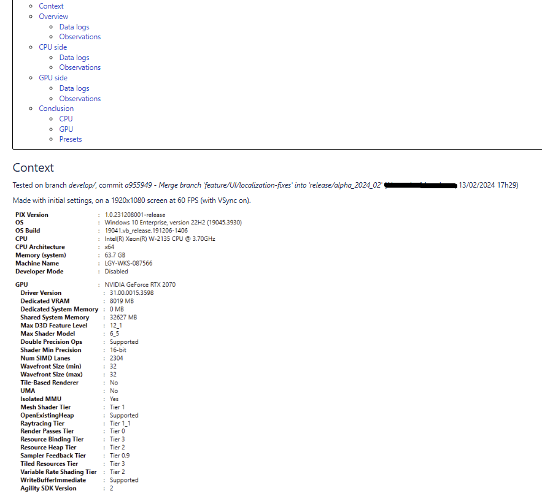

# Rapport profiling GPU - Pix (1h)

!!! Réflechissez à ce sujet avec de passer à la suite. 
Que devrait contenir un rapport de profiling pour vous ?

Un rapport de profiling est un document permettant de mieu comprendre le fonctionnement du jeu. Celui ci peut contenir beaucoup d'élement d'étude:
- Profiling CPU
- Profiling GPU
- Analyse de draw call et du bus CPU/GPU
- Impacte RAM
- Impacte VRAM (extrement important sur Ios)
- Analyse des spicks/freezes
- Consomation d'energie / évolution de la batterie (important sur mobile)
- Chauffe du device (important sur mobile)

Un rapport de profiling doit être réflechi avant d'être attaqué. Il faut 
- définir sur quel device faire tourner le teste (low end ou device aillant le plus de tool de profiling ?)
- définir les scenes à étudier (homescreen ? core gameplay ? Context spécifique du jeu)
- définir dans quelle condition on réalise le teste (premier lancement ? Device chaud ? Build release ou dev ?)
- Avec quel parametre graphique on étudie le jeu (graphique setting low/medium/high, autre...)

Il est important de définir clairement le contexte choisie et de mettre des screens car le jeu évolue vite et c'est ce qui permet a certaine data d'être compararer et de rester exploitable sur le long terme.

Voici un example de rapport de profiling:
 
 
 
 
 
 

Ce rapport est très simple mais m'a permis d'étudier les preset graphique du jeu sur lequel j'ai travailler afin de mieu les étalonners. 

A vous maintenant de faire l'analyse d'un projet de votre choix (celui fourni ou un autre en dev build si vous le pouvez). Essayer de comprendre le fonctionnement du jeu et analysez l'une de ses frame. 

Saviez vous que c'est une pratique courante chez les developpeur rendu ? C'est une méthode permettant de se mettre en jour et de comprendre certaine technique de rendu : [link](https://www.adriancourreges.com/blog/2020/12/29/graphics-studies-compilation/)